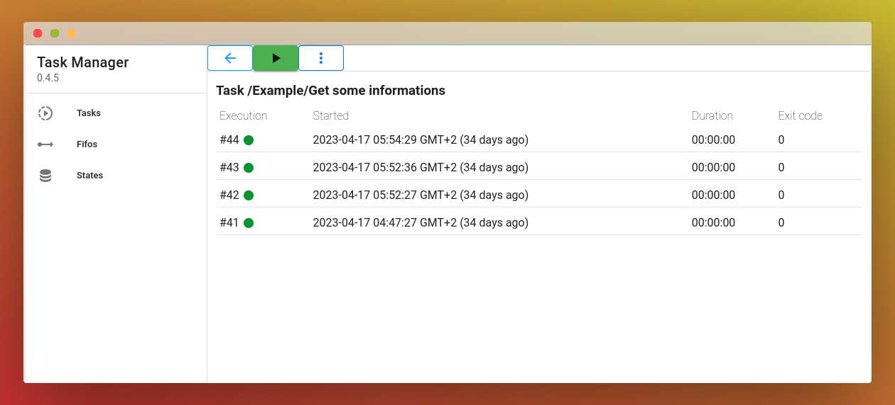
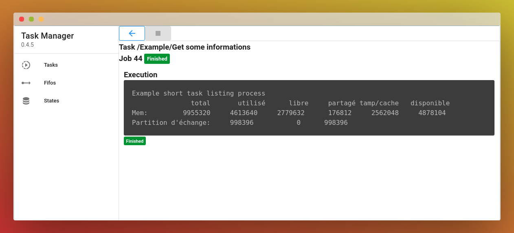

# tm

tm is a simple task manager. It's a rewrite of [Workr](https://github.com/sirikon/workr) with C++ in backend and VueJS 2 in frontend and with some [differencies](./doc/Workr.md).

Don't expect extensive maintenance on this project as it meets almost all my needs (an open source project does not mean [free work](https://raccoon.onyxbits.de/blog/bugreport-free-support/) or [open governance](https://words.werd.io/open-source-does-not-mean-open-governance-8ab751136106)).

Tasks are just runnable scripts in plain text.

<p align="center" >
    
</p>
<p align="center">
    
</p>
<p align="center">
    
</p>
<p align="center">
    
</p>

## Installation

Download the package corresponding to your distribution. If your distribution is not derived from debian or devuan then you will probably have to rebuild the project [from source](./doc/Build.md).

It is recommended to use `gdebi` if you are installing `tm` for the first time to automatically install the dependencies.

```sh
apt-get install gdebi-core
gdebi tm_0.1.0-1_amd64.deb

```

## Configuration

The service starts as root by default. It is recommended to change the user.
The configuration file is located at `/etc/default/tm`.

```sh
# User running the daemon
DAEMON_USER=
DAEMON_GROUP=

# Directory containing tasks and jobs
# APP_STORAGE_PATH=/var/lib/tm

# Custom title of the application
# APP_TITLE=

# Custom http port
# APP_PORT=18080

# Log level = debug, info, warning, error, critical
# APP_LOG_LEVEL=warning

# Signal number to send when trying to stop a task
# See /usr/include/x86_64-linux-gnu/bits/signum-generic.h
# Default value is 15 (SIGTERM)
# APP_KILL_SIGNAL=15
```

If you change the user you should also change the owner of the storage directory (and the subdirectories) which is `/var/lib/tm` by default.

After the changes, it is must restart the service with `/etc/init.d/tm restart`

## The web application

The application is available at http://localhost:18080/web/

## Add scripts

You can add your scripts inside `/var/lib/tm/tasks` :
* A task is a folder that contains a script called `run.sh`
* The name of the task is the folder's name

## Some examples

You can copy the [Example](./doc/Example) directory inside `/var/lib/tm/tasks` and refresh your web page

## API

You can start a task with the given URL with the 3 vertical dots button

```sh
curl http://localhost:18080/api/task/by_path/%2FExample%2FGet%20some%20informations/execute
```

## Task configuration

The configuration is the `task.json` file next to the `run.sh` file.

* max_log_jobs

Indicates the maximum number of logs to keep. The oldest logs will be purged at the end of each task execution.
The `-1` value (default) disable the automatic purge.

```json
{
  "max_log_jobs": 4
}
```

## Build from source

[documentation here](./doc/Build.md)

