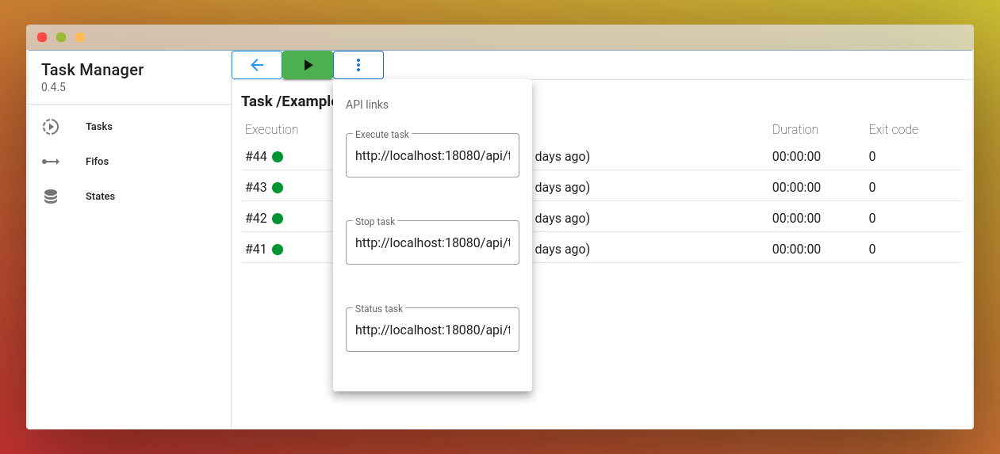

# tm

tm is a simple task manager. It's a rewrite of [Workr](https://github.com/sirikon/workr) with C++ in backend and VueJS 2 in frontend and with some [differencies](./doc/Workr.md).

I added Fifos and States because I found [state management](https://docs.dapr.io/getting-started/quickstarts/statemanagement-quickstart/) and [publish and subscribe](https://docs.dapr.io/getting-started/quickstarts/pubsub-quickstart/) very usefull but Dapr is way to heavy for that task.

Don't expect extensive maintenance on this project as it meets almost all my needs. An open source project is not :
* [free work](https://raccoon.onyxbits.de/blog/bugreport-free-support/)
* [open governance](https://words.werd.io/open-source-does-not-mean-open-governance-8ab751136106)
* [about you](https://gist.github.com/richhickey/1563cddea1002958f96e7ba9519972d9)

Tasks are just runnable scripts in plain text.

<p align="center" >
    
</p>
<p align="center">
    
</p>
<p align="center">
    
</p>
<p align="center">
    
</p>

## Installation

Download the package corresponding to your distribution. If your distribution is not derived from debian or devuan then you will probably have to rebuild the project [from source](./doc/Build.md).

It is recommended to use `gdebi` if you are installing `tm` for the first time to automatically install the dependencies.

```sh
apt-get install gdebi-core
gdebi tm_0.1.0-1_amd64.deb

```

## Configuration

The service starts as root by default. It is recommended to change the user.
The configuration file is located at `/etc/default/tm`.

```sh
# User running the daemon
DAEMON_USER=
DAEMON_GROUP=

# Directory containing tasks and jobs
# APP_STORAGE_PATH=/var/lib/tm

# Custom title of the application
# APP_TITLE=

# Custom binding address
# APP_BIND=127.0.0.1

# Custom http port
# APP_PORT=18080

# Log level = debug, info, warning, error, critical
# APP_LOG_LEVEL=warning

# Signal number to send when trying to stop a task
# See /usr/include/x86_64-linux-gnu/bits/signum-generic.h
# Default value is 15 (SIGTERM)
# APP_KILL_SIGNAL=15
```

If you change the user you should also change the owner of the storage directory (and the subdirectories) which is `/var/lib/tm` by default.

After the changes, it is must restart the service with `/etc/init.d/tm restart`

## The web application

The application is available at http://localhost:18080/web/

## Add scripts

You can add your scripts inside `/var/lib/tm/tasks` :
* A task is a folder that contains a script called `run.sh`
* The name of the task is the folder's name

## Some examples

You can copy the [Example](./doc/Example) directory inside `/var/lib/tm/tasks` and refresh your web page

## API

* Start a task without parameters

You can start a task (without parameters) with the given URL with the 3 vertical dots button :

```sh
curl 'http://localhost:18080/api/task/by_path/%2FExample%2FGet%20some%20informations/execute'
```

* Start a task with parameters

You can also start a task with (or without) parameters (up to 50 paramaters) with the same url but adding parameters p1 to p50 : The first parameter must be preceeded by `?`. From the second parameter, the parameter must be preceeded by `&`

**Don't forget to enquote the url with `'` or `"` because of the `&` character from the second parameter.**

In the following example, the first parameter `p1` has the value `value1` and the second parameter `p2` has the value `value2`. These parameters (only the values) will be passed to the script in the order p1 to p50. The parameters must start from p1 and be continuous.

```sh
curl 'http://localhost:18080/api/task/by_path/%2FExample%2FGet%20some%20informations/execute?p1=value1&p2=value2'
```

## Task configuration

The configuration is the `task.json` file next to the `run.sh` file.

* max_log_jobs

Indicates the maximum number of logs to keep. The oldest logs will be purged at the end of each task execution.
The `-1` value (default) disable the automatic purge.

```json
{
  "max_log_jobs": 4
}
```

* description

A simple text to describe the task.

```json
{
  "description": "This is a simple description"
}
```

## Fifo

Fifo means First In First Out. Fifo is a trivial queue in order to send a json payload from one sender to one receiver. One the receiver received the payload, the payload is deleted. The queue is limited to 100000 files.

* Send a json payload to a fifo

The payload must be send via the body with a POST request. The fifo name can contain only ascii letters, numbers and underscore characters `_`.

```sh
# The fifo name is : this_is_a_fifo_test
curl -H POST http://localhost:18080/api/fifo/push/this_is_a_fifo_test -d '{ "desc": "test" }'
```

* Retreive the json payload from a fifo

```sh
# The fifo name is : this_is_a_fifo_test
curl http://localhost:18080/api/fifo/pull/this_is_a_fifo_test
```

* Delete a fifo

All existing payload (not retrieved) will be deleted.

```sh
# The fifo name is : this_is_a_fifo_test
curl http://localhost:18080/api/fifo/delete/this_is_a_fifo_test
```

## State

A state is just a text payload which is persisted.

* Store a text payload

The payload must be send via the body with a POST request. The state name can contain only ascii letters, numbers and underscore characters `_`.

The state is persistent until it is explicitly destroyed.

```sh
# The state name is : this_is_a_state_test
curl -H POST http://localhost:18080/api/state/store/this_is_a_state_test -d '{ "desc": "test" }'
```

* Read the text payload from a state

```sh
# The state name is : this_is_a_state_test
curl http://localhost:18080/api/state/read/this_is_a_state_test
```

* Delete a state

```sh
# The state name is : this_is_a_state_test
curl http://localhost:18080/api/state/delete/this_is_a_state_test
```

## Build from source

[documentation here](./doc/Build.md)

